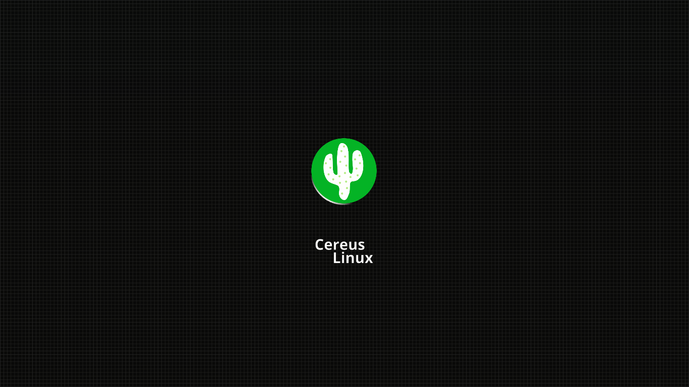

# cereus_simply
A simply plymouth theme for Cereus Linux

# INSTALLATION:
You can install manually using the next commands on your terminal:

 git clone 
 
 sudo cp -r cereus_simply/ /usr/share/plymouth/themes/
 
 sudo plymouth-set-default-theme -R cereus_simply
 
# License
This theme is licensed under GPLv3, for more details check LICENSE.
